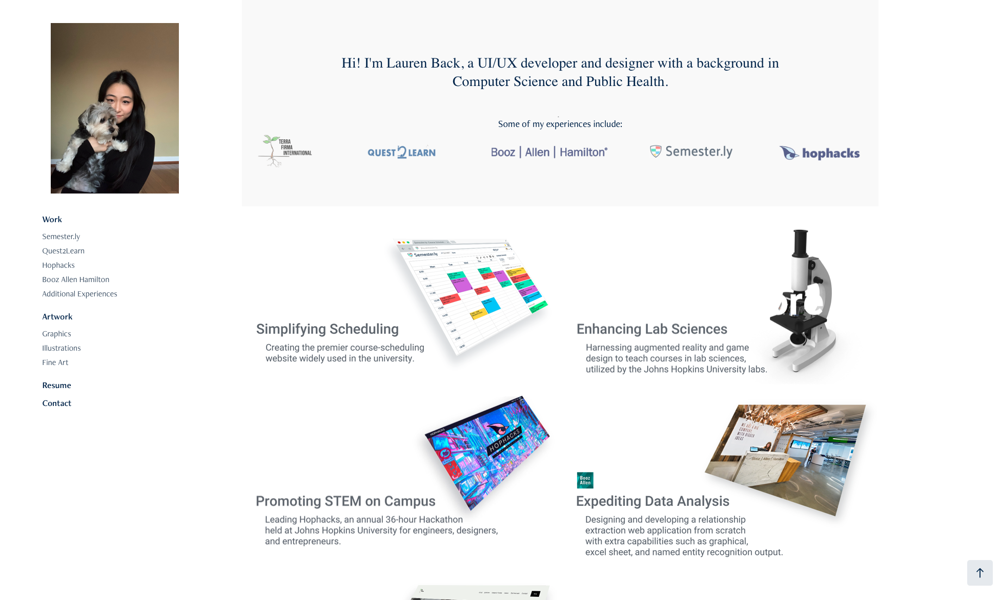
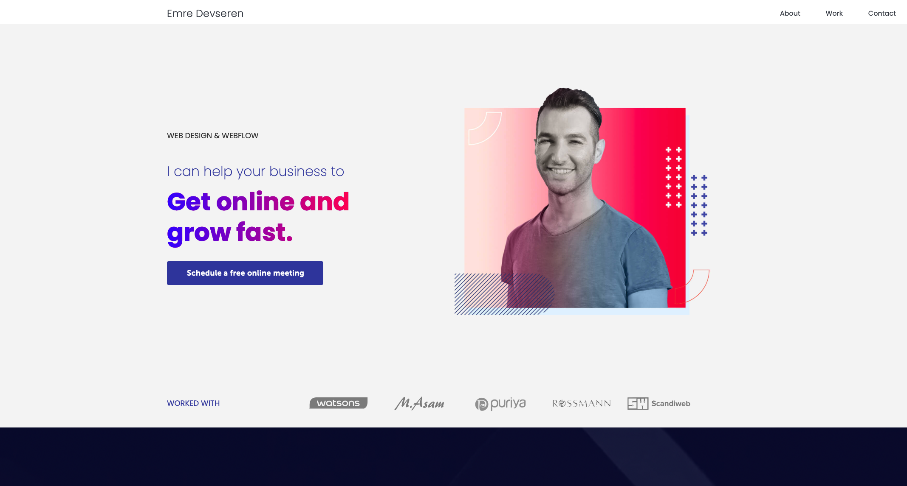
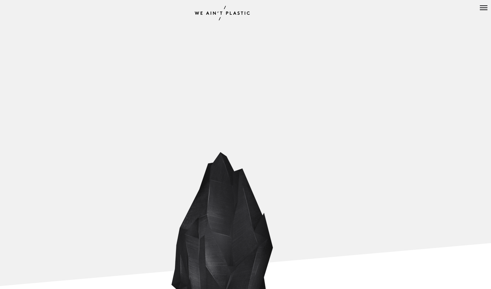
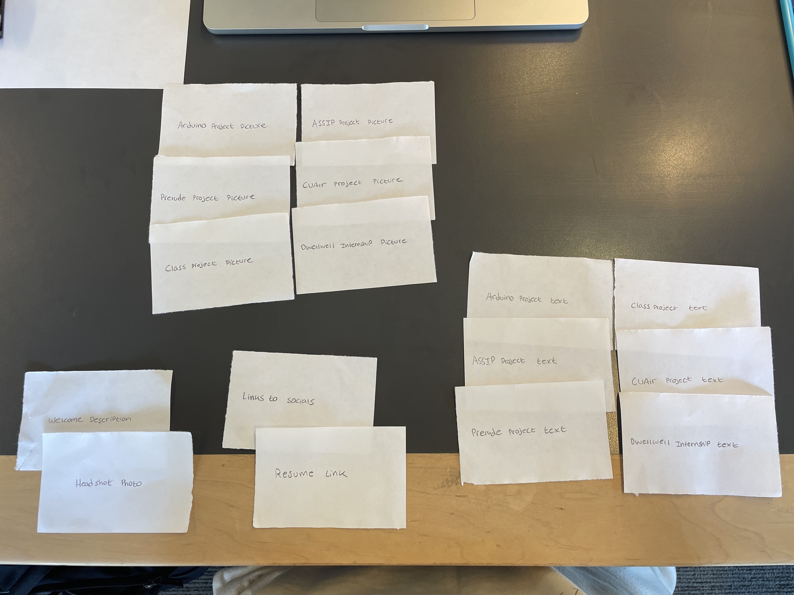
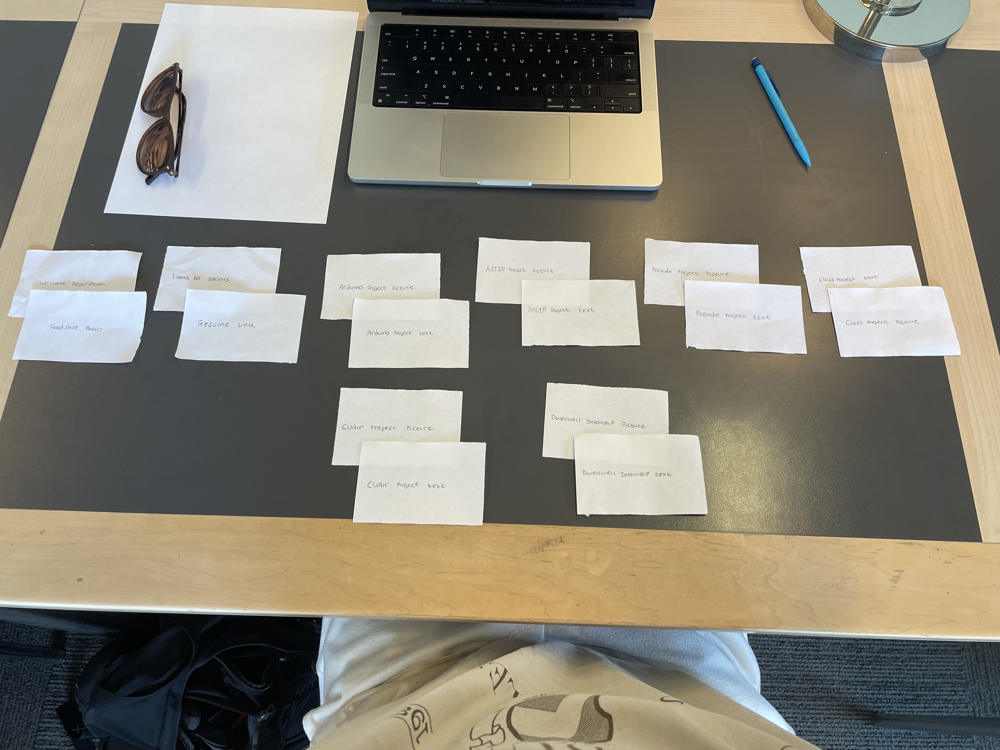
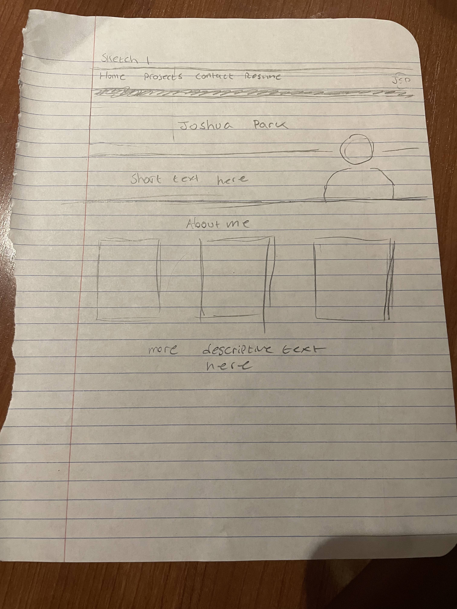
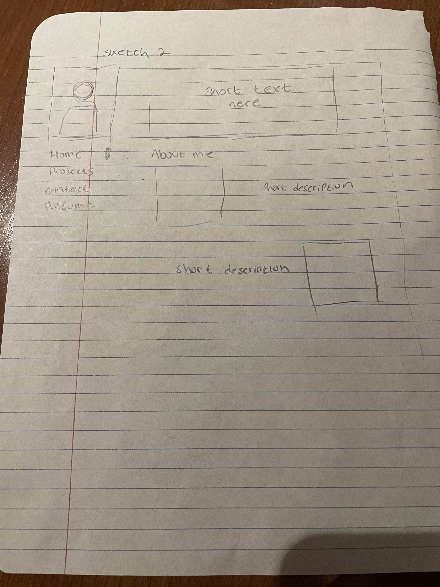
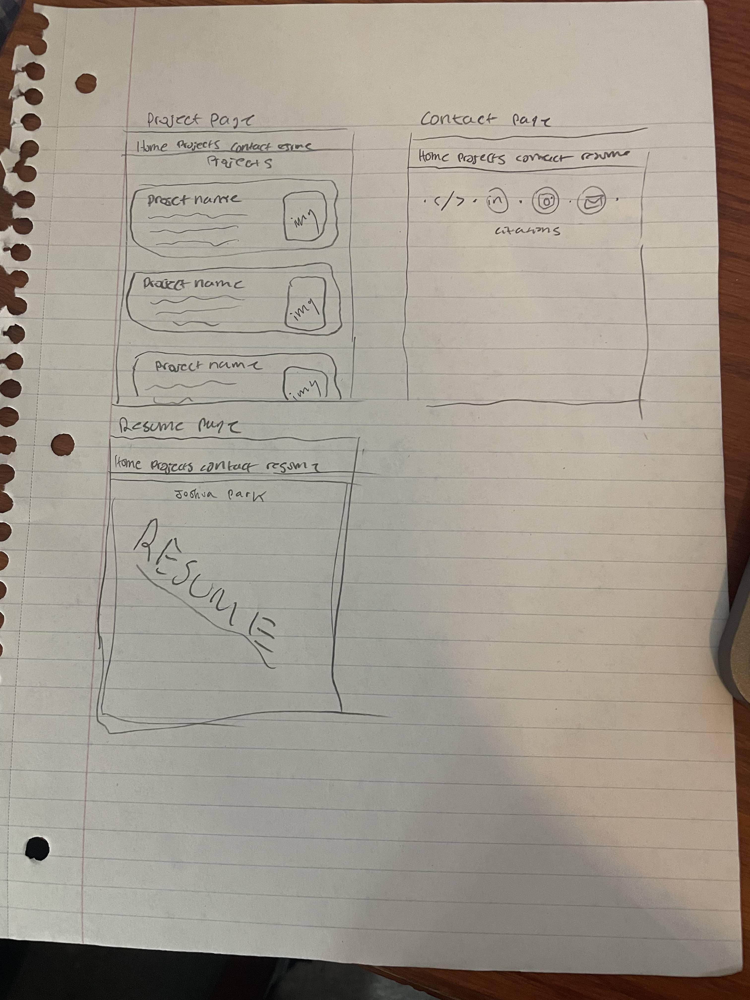

# Project 1: Design Journey

**For each milestone, complete only the sections that are labeled with that milestone.** Refine all sections before the final submission.

You are graded on your design process. If you later need to update your plan, **do not delete the original plan, leave it in place and append your new plan _below_ the original.** Then explain why you are changing your plan. Any time you update your plan, you're documenting your design process!

**Replace ALL _TODOs_ with your work.** (There should be no TODOs in the final submission.)

Be clear and concise in your writing. Bullets points are encouraged.

**Everything, including images, must be visible in _Markdown: Open Preview_.** If it's not visible in the Markdown preview, then we can't grade it. We also can't give you partial credit either. **Please make sure your design journey should is easy to read for the grader;** in Markdown preview the question _and_ answer should have a blank line between them.

## Personal Site (Milestone 1)

### Website Topic (Milestone 1)
My website will be about me, Joshua Park, and my personal and career related experiences.

## Personal Website Design Exploration (Milestone 1)

Identify three personal websites (preferably static websites) that exist today on the web. You will be drawing inspiration from these sites for your own site; please select websites that are similar to the website you wish to create.

Include a screenshot of the home page for each site. If you're planning a mobile website, your screenshots should be from a mobile website. If you're planning a desktop website, your screenshots should be from a desktop website.

**We'll refer to these are your "example websites."**

1. <https://sujinback.com/>

    

2. <https://emredevseren.webflow.io/>

    

3. <https://weaintplastic.com/>

    )

### Personal Website 1 Review (Milestone 1)
> Review the personal website you identified above. (1-2 paragraphs)
>
> - Who do you think this site is designed for? Who is its intended audience?
> - What **goals** do you think the audience likely has when visiting this site.
> - What **content** is included?
> - Do you believe the content likely **addresses** the goals of the site's audience?
> - What do you like about the design?
> - Is the site designed for desktop, mobile, or desktop and mobile devices?

This site is designed for prospective employers looking to hire someone with a specific skill set. The goal of the audience would be to examine the past work and experiences of the person in question
and whether or not they think the employee would be a good hire. The content on the website includes past projects, resume, contact information, and a picture of the person.
The content addresses exactly an employer would look for when interview this candidate. One design aspect that I like is how Everything the employer needs to make an assessment is very easy to locate right on the home page
and if they wished it is easy to find out more information about a specific topic. This website is also designed for both desktop and mobile devices.

### Personal Website 2 Review (Milestone 1)
> Review the personal website you identified above. (1-2 paragraphs)
>
> - Who do you think this site is designed for? Who is its intended audience?
> - What **goals** do you think the audience likely has when visiting this site.
> - What **content** is included?
> - Do you believe the content likely **addresses** the goals of the site's audience?
> - What do you like about the design?
> - Is the site designed for desktop, mobile, or desktop and mobile devices?

This website is designed for prospective clients looking for a web designer to build a website for a product or service.
The goal the audience has is to find someone that can build a webflow in a style that they like.
The content in the home page includes some past experience for credentials, a headshot, link to portfolio, link to contact, and a way to schedule a meeting.
This page addresses the needs of the audience by providing them a means to connect if they wish to work with this web designer.
I like how the likeness of the designer is put at the center of attention to highlight who the client will be working with.
This site is designed for both mobile and desktop.

### Personal Website 3 Review (Milestone 1)
> Review the personal website you identified above. (1-2 paragraphs)
>
> - Who do you think this site is designed for? Who is its intended audience?
> - What **goals** do you think the audience likely has when visiting this site.
> - What **content** is included?
> - Do you believe the content likely **addresses** the goals of the site's audience?
> - What do you like about the design?
> - Is the site designed for desktop, mobile, or desktop and mobile devices?

This website is designed for either clients or employers looking to hire a product developer or a lead in design of some sort.
The goal of these employers is to see the experiences of the candidate they are about to hire. In this case the candidate is quite decorated.
The content included in this website is the designers past work, contact info, workflow, awards, and different social medias. One aspect I like about
this site is how it's all in one scrollable page and it gets more interactive as you scroll down.
This site is designed for both desktop and mobile devices.
## Audience & Goals (Milestone 1)

Using what you learned from studying the example websites, identify your website's audience and their goals.

### Audience (Milestone 1)
> Briefly explain who the intended audience is for your website. Be specific and justify why this audience is appropriate for your site's topic.

The site's audience would be any future employers I would apply to. This makes sense because interviewers would probably like to see how I look like and if I have the skillset they are looking for.
What better way to showcase your skills than in a beautiful website that makes it easy for them to assess in a matter of seconds.

### Audience Goals (Milestone 1)
> Why would your audience visit your site?
> Identify at least 3 goals that your users have for visiting your website.

1. To see how I look like

2. To see my past experience

3. To find a way to contact me if they liked me

## Content Planning (Milestone 1)

Plan your site's content.

### Your Site's Planned Content (Milestone 1)
> List **all** the content you plan to include your personal website.
> You should list all types of content you planned to include (i.e. text, photos, images, etc.)

- Welcome description
- Headshot picture
- Arduino Project description and pictire
- ASSIP Project description and picture
- Prelude Project description and picture
- Class Project description and picture
- CUAir Project description and picture
- Dwellwell internship Project description and picture
- Links to social
- Resume link

### Content Justification (Milestone 1)
> Explain (about a paragraph) why this content is the right content for your site's audience and how the content addresses their goals.

This content addresses any future employers that are looking to hire me as it displays everything they need to know in one place.
They are able to see my likeness, my technical skill, a formal resume, and multiple places to contact me.
If they do want to know more about my projects these employers are able to contact me about it or click on the project in question to learn more.
Since the goal of the employers is to see if I am fit for a role, the content displayed shows demonstration of compentency.

### Home Page Content (Milestone 1)
> What is the content that your users would expect when visiting your site for the first time.
>
> Briefly identify what content you will include on the homepage and why this content should be the first thing your target audience sees when they visit your site.

Navigation bar to get to my projects, resume, and contact info and a picture of me with a brief description so that they don't get confused if they are also considering multiple other candidates.

## Information Architecture (Milestone 2)

For milestone 2, you will design the information architecture for all the pages your website.

You may change your homepage content based on your card sorting. If you do change the homepage content, don't update it above, just include the new plan in the section below (Content Organization).

### Content Organization (Milestone 2)
> Document your **iterations** of card sorting here. You must have at least 2 iterations of card sorting.
> Include photographic evidence of each iteration of card sorting **and** description of your thought process for each iteration.
> Please physically sort cards; please don't try and do this digitally.

For this card sort iteration I wanted to group all the text description of my projects in one place because employers would probably
want to hear about the content behind the project and what I learned from them and have them all in one place. After all, they don't
really care how your project really worked as long as you can accomplish something that they need you to do for them. Then I grouped the pictures together so that if the prospective employers were curious to how it looked they could go to all the section with all the pictures.

The second card sort iteration I grouped the content by project. I paired each project description with its picture. This way when
employers read the project description, the pictures right next to it would help them visualize what the text is describing.
I was thinking that if a employer was interested in a particular project because it is most similar to what they are working on
or just personal curiosit, they can learn all about it in one place instead of 2 separate sections. If groups were not clear they are: Home, Projects (grouped by image and text), Contact, and Resume.

### Final Content Organization (Milestone 2)
> Which iteration of card sorting will you use for your website?

I want to use the second iteration

> Explain how the final organization of content is appropriate for your site's audiences.

This makes most sense to the employer because of the broad range of projects that I have done. A company like Facebook who doesn't
even have any physical products wouldn't want to know about the car project I did. Nor would Tesla want to know abouta a flight path testing project when they don't manufacture planes. This way the employer could look at the picture that they are interested in instead of looking for the description and the picture twice out of a catalog of irrelevant projects.

### Navigation (Milestone 2)
> Please list the pages you will include in your website's navigation.

- page 1
  - Home
- page 2
  - Projects
- page 3
  - Contact
- page 4
  - Resume

> Explain why the names of these pages make sense for your site's audience.

The names of these pages makes sense to the audience because Home page would be the page that the employers first land on. Then in the navigation bar they would be able to see the different technical experiences i've had in the projects section of the navigation. This includes coding projects and different technical projects. Either way employers would be watching out for that word. If they did like what I am able to do then they would want a way to reach me. Hence, contact is the word that they would want to look for. Lastly, for formal reasons, if they wanted to see my resume and see my education they are able to do so in the resume page.

## Visual Themes (Milestone 3)

**Make the case for your decisions using concepts from class, as well as other design principles, theories, examples, and cases from outside of class.**

Remember to focus on the things we can't see just by looking at the site: changes, alternatives considered, processes, and justifications.

Each section is probably around 1 reasonably sized paragraph (2-4 sentences).

### Theme Ideas (Milestone 3)
> Discuss several (more than two) ideas about styling your site's theme. Explain why the theme ideas are appropriate for your target audiences.

Theme 1:

- Color
  - Blue highlight theme to highlight certain elements and add have some elements stick out. Offwhite cream-ish background instead of all white to not put too much stress on the viewer's eyes.
- Shape
  - A minimalist outline without too many shapes and edges. The only edges would be dividing sections and different projects.
- Typography
  - A clean easy to read font like Open Sans would be very clear and have no confusion unlike other cursive fonts.
- Imagery
  - A very minimalistic imagery would show professionalism. The pairing of only technical images with text would give a very project driven imagery to the website. Perfect for employers. Add a cool logo on the top right that's a computer science theme.

Theme 2:

- Color
  - Pure white theme to have a sterile professional look.
- Shape
  - No edges whatsoever to mimic a kind of hospital environment or a limbo space (kind of like that white space at the end of harry potter).
- Typography
  - Roboto font which mimics the font that VSCode and other IDE uses. This makes it unmistakable that the website is to showcase technical projects
- Imagery
  - This very sterile imagery with black and white vector images that represents different projects would also give it a technically focused vibe.

Theme 3:

- Color
  - Red, Blue, Purple theme to have an energetic playful theme but not too much energy that it becomes too much to handle.
- Shape
  - Lots of shapes inside colored highlight boxes, like circles and curvy lines. A but more boxes that highlight each project.
- Typography
  - Bolded and impacted easy to read font for headings and thinner font for other subheadings that are not as important.
- Imagery
  - Clean colorful vector art for each section of the website. With different styled shapes for decorative elements that embelish either my headshots or the project images.

### Final Theme (Milestone 3)
> Which theme did you select as your final theme? Why?

Theme 1 because it is the perfect blend between minimalistic and aesthetic while not sacrifcing anything in terms of usability for the employer. If usability is affected in anyway it would greatly decrease my chances at getting the position that I applied for so being able to find content quickly is the number one priority.

### Theme Rationale (Milestone 3)
> Discuss your final theme design: how do they fit your overall design goals and audiences?

The first design really showcases the aesthetic yet minimalistic purpose of the website. I want the employer's eyes to be pleased but not at the expense of the actual meat and purpose of the website. This theme is easy to navigate so the employer can locate what they want in a matter of seconds and it has an aesthetic that conveys professinoalism and technical compentence.

> Emotion is a big part of design. What emotions were you thinking about or trying to convey in your designs?

The use of a blue theme suggests a sense of calmness, trustworthiness, and professionalism. This color choice may indicate that the website aims to establish a reliable and dependable image. It can also evoke a feeling of stability and security, which is often associated with corporate and business-related content.
The sparse use of shapes with few sharp edges contributes to a minimalist and clean design aesthetic. This design choice creates a sense of simplicity and sophistication. It implies that the website's focus is on clarity and ease of navigation, avoiding unnecessary distractions and visual clutter.
The choice of clean and clear fonts indicates a commitment to readability and professionalism. It suggests that the website values the effective communication of information. This font choice ensures that visitors can easily consume and understand the content without any visual obstacles.
Pairing well-aligned images with project descriptions demonstrates a commitment to showcasing work or projects in a visually appealing and organized manner. It suggests that the website is likely presenting a portfolio or showcasing various creative or professional projects. The alignment of images with project descriptions enhances the user's experience by providing context and visual reinforcement for the content.

## Composition (Final Submission)

### Home Page Composition (Final Submission)
> Include at least two sketches of possible composition ideas for the home page.
> Provide an explanation for each sketch explaining the idea.
> Show your design process.
> **Use the example websites above as inspiration for your site's design.**

This sketch primary feature over the other is having a prominent banner style layout. The navigation bar is at the top and most visible and features a short text to introduce me. I'm going to have to add three more photos of my interest and not projects. This section won't be visibile on the landing page to not draw attention away from the projects, but will be availble for employers who want to know that I am a real human with interests instead of a robot.

This sketch is a simpler sketch than the first one because it is more of a collection of images and text containers. Something akin to a powerpoint presentation put together in a couple minutes. This design features a lot of edges and containers to really separate out the different sections. The simpler layout may also be a bit easier to navigate because the navigation is on the side instead of the top.

### Final Site Design (Final Submission)
> Include a sketch of the final composition for each page in your site.
> Provide an explanation below each sketch.

The page that shows all my projects I went for a catalog kind of vibe with rounded edges to kind of give it the Apple look. The buttons could lead to more detailed explanation of the project in the future so I wanted it to look like it COULD be clickable but not to the point it is confusing. The contact page is simple enough where the logos of the respective social medias lead to my profile so the employers could view them too without having to look it up themselves. Finally the resume page I wanted it to be the only thing on the page or else it distracts from the meat of the content although it is purposely boring.

### Static Website Design Check (Final Submission)
> We're building a static website without interactivity.
> **No part of your website may dynamically change.**
> Examples of dynamic behavior are dropdown menus, hamburger menus, popups, modals/lightboxes, image carousels, etc.
>dfd
> Audit your design and check that you aren't relying on any dynamic features.
My static website is characterized by its fixed and unchanging content, composed of HTML files that display the same information to all users without any dynamic or personalized elements. Unlike dynamic websites, which can adapt content based on user interactions or database-driven data, static websites maintain a consistent appearance and information for every visitor. The content on this static website is coded directly into the HTML files and does not rely on server-side scripting languages or databases. This simplicity and lack of complexity makes my static website quick to load, highly secure, and easy to host, making it an ideal choice for showcasing straightforward information, such as portfolios, blogs, or small business websites, where frequent updates or interactivity is not required. However, for websites with complex functionality, frequent content updates, or interactive features, dynamic websites, which can generate content on the fly, are usually a more suitable choice.

## Rationale (Final Submission)

**This rationale should be polished writing:** one you might submit as a report to a client or boss to help explain the project and convince them you did a good job. You'll be surprised how much writing and communicating you need to do about projects and choices on internships and jobs; practice that here.

It should be a comprehensive, complete story of the project. You might find that each section runs a few paragraphs (1-2). Sketches can often help tell the story of your design. Screenshots are also useful for describing issues discovered during the design process and how you addressed them.

**All images must be visible in "Markdown: Open Preview" for credit!**

Your rationale should be a polished version of the earlier explanations.

### Audience (Final Submission)
> A complete and polished description of the intended audience(s) for your website.

Foremost, this website is tailored for potential employers and professional contacts. It's more than just a conventional resume; it's a platform where they can explore my professional background, skills, and accomplishments in-depth. My resume is readily accessible, providing a comprehensive overview of my work experience and qualifications.

This website is designed to provide employers with a well-rounded view of who I am. In addition to showcasing my professional achievements, I've included personal photos and glimpses into my hobbies and personal life. These elements are intended to convey not just my qualifications but also my likable personality and character. I believe that a likable and relatable individual can be a valuable asset in any professional setting.

My website also serves as a networking tool for fellow professionals and potential collaborators. By showcasing my projects, I aim to demonstrate my expertise and the quality of my work, which may lead to valuable connections and partnerships.

### Design Goals (Final Submission)
> An explanation of the design goals for that audience, based on your earlier rationales.

My minimalist theme is ideal for personal websites aimed at employers due to its professional and uncluttered design. It directs attention to your qualifications and portfolio, allowing for easy navigation and readability. Its mobile-friendly nature ensures accessibility on various devices, and its fast loading speed reflects positively on your attention to detail. Minimalism's timelessness and scalability make it a practical choice for showcasing career progression, while providing a consistent platform for your personal brand. I will be able to update this with ease as I gain more experiences and opportunities. Ultimately, it presents a clean and sophisticated image that resonates with employers seeking professionalism and clarity.

### Content Organization & Navigation (Final Submission)
> An explanation of how the final content organization and navigation met your goals and why it's appropriate for your audience.

Pairing project pictures with descriptions on my personal website serves as a strategic design choice that significantly enhances an employer's ability to navigate my technical skills effectively. It's an approach that simplifies the process of comprehending my professional achievements while also allowing them to gauge my personal attributes.

The inclusion of project images alongside their respective descriptions offers an immediate visual context for my work. This combination provides employers with a rapid snapshot of the nature and complexity of each project. They can grasp the essence of my work without the need to delve into lengthy technical descriptions. This visual representation streamlines their initial assessment and helps them quickly identify projects that align with their requirements. This visual content tends to be more engaging than text alone. By incorporating project images, I can capture an employer's attention and draw them into my work. This engagement can pique their interest and encourage them to explore my projects in greater depth. It creates a dynamic and interactive experience that showcases my technical skills in a compelling manner.

The efficiency of comprehension is another critical aspect of this design choice. Pairing visuals with descriptions facilitates a more straightforward and efficient understanding of my projects. Employers can swiftly gauge my technical capabilities and achievements, saving them time and effort in deciphering my work history. This streamlined approach ensures that the employer's initial impression of my technical skills is both comprehensive and efficient.

As for grouping more personal information together, this strategy aligns with the goal of presenting a well-rounded professional persona. Employers don't just seek technical expertise; they also want to understand the person behind the skills. Grouping personal information, such as photos and hobbies, with my professional content sends a clear message about my personal brand. It conveys that I am not merely a collection of technical skills but a well-rounded individual with interests and a likable personality. Employers often want to gain a sense of the whole person they might be hiring. By consolidating personal information in one section, I simplify the process for employers. They don't have to navigate through different sections of my website or search across various social media profiles to find relevant personal details. This organization is a considerate gesture that respects their time and effort.

### Visual Design (Final Submission)
> An explanation of how the final design met your goals and why it's appropriate for your audience.

I've opted for a clean and minimalist layout with a subtle background to draw attention to the projects themselves. The header prominently displays my name and logo and a navigation menu that they cannot possibly miss, ensuring that users can seamlessly navigate between different sections of my website, enhancing overall user experience.

The heart of the page lies in the project catalog, where I've meticulously organized my work into a visually appealing grid format. Each project is encapsulated within a rectangular card with rounded edges, mirroring Apple's renowned design philosophy. This choice not only provides an elegant and modern look but also conveys a sense of familiarity to users.

To make the projects appear interactive without causing confusion, I've implemented subtle shadow effects. At the end of the project card, it darkens slightly and has a subtle shadow, offering an elevated feel almost like a button but not quite. I intend to turn it into a button to navigate to a more in depth analysis of the project in the future. This design decision strikes a balance between aesthetics and usability.

This is appropriate for my audience because it creates a seamless way to almost browse my catalog of experiences. After all, employers are “shopping” for talent almost like everyone else would when they are shopping for new clothes or groceries. It is only appropriate that they can shop for my skills too.

### Self-Reflection (Final Submission)
> Take some time here to reflect on how much you've learned since you started this class. It's often easy to ignore our own progress. Take a moment and think about your accomplishments in this class. Hopefully you'll recognize that you've accomplished a lot and that you should be very proud of those accomplishments!

Reflecting on the past month, I'm truly amazed at how much I've learned about HTML and CSS, considering that I started with zero prior knowledge. This journey has been nothing short of transformative, both in terms of technical skills and my approach to content creation.
I can now confidently create and style web pages using HTML and CSS. From crafting the fundamental structure of a webpage to adding visual appeal through CSS, it's incredible to see how I've progressed.

One of the most valuable lessons I've gained from this experience is the importance of planning and audience-centered content structuring. I've learned that web development isn't just about writing code; it's about understanding the end-users and tailoring the content to their needs. Whether it's a personal website for potential employers or a project aimed at a specific audience, I've discovered the significance of clear planning and organization.

I've come to appreciate the art of crafting content that is not only visually appealing but also user-friendly and intuitive. This newfound knowledge has not only enhanced my technical skills but also my ability to communicate effectively through web design. It's a skill set that I believe will serve me well in various aspects of my personal and professional life.

## Grading (Final Submission)

### Grading: Open the Design Journey in Markdown: Open Preview (Final Submission)
> Preview your design journey in VS Code. Please verify that this document is easy to read/grade.
>
> - Remove all _TODOs_
> - All images must be visible.
> - All images must be oriented the correct way.
> - There should be a blank line between the question prompt and your answer.
>
> Is your design journey easy to read?

### Collaborators
> List any persons you collaborated with on this project.

### Resources
> Please cite any external resources you used in the creation of your project.

Citation for logos
https://www.iconfinder.com/icons/5279114/linkedin_network_social_network_linkedin_logo_icon
https://www.iconfinder.com/icons/5279112/camera_instagram_social_media_instagram_logo_icon
https://freesvg.org/mail-icon-white-on-black
